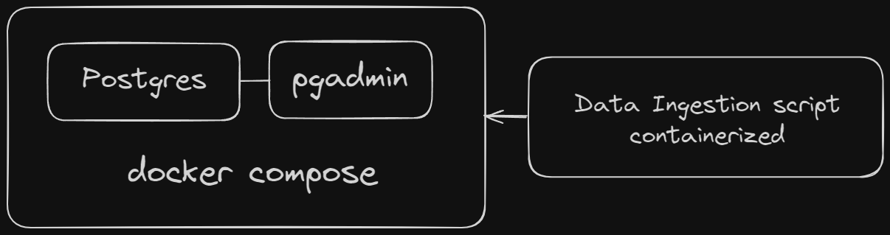

# First week of Zoomcamp: Docker and Postgres

Learnings and work from the course - [Data Engineering Zoomcamp by DataTalksClub](https://github.com/DataTalksClub/data-engineering-zoomcamp)

Using Spark and a Parquet file instead of regular Pandas and CSV proved to be a much more challenging experience.
Multiple issues with installation and environment variables for Java. Additional jar installation for Postgres. Huge educational moment.

Python script that downloads either .parquet or .csv, infers the schema and uploads it to Postgres

Data Engineering with one single dataset does not sound fun, so what if we try to get *all* the data that's available there (*get_data.py*) and ingest it into each individual table by their respective year and month (*pyspark_directory_ingestion.py*), following the convention that's been initially given. It results in 150+ tables but is arguably cleaner.

  
  ^total_row_count.py
  
  At this moment the mapping to the db ate approximately 150GB of storage that I had left and the whole process shut down. This was a prime example of how great parquet compresses the data. Initially, it was ~27 gb of .parquet
